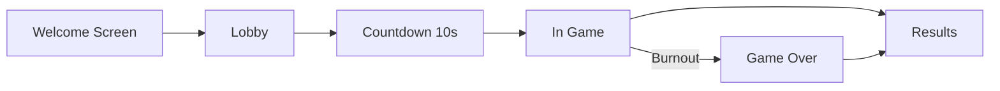

# Oh My Hungry God - Multiplayer Implementation

Complete multiplayer AR game implementation for Global Game Jam 2026.

## 🎮 What Was Built

A synchronous multiplayer system transforming the single-player AR game into a collaborative experience:

- **Authoritative .NET 9 Backend** with SignalR WebSocket communication
- **Web Host Display** showing game state on TV/projector
- **iOS AR Clients** as controllers, throwing fruits via AR

## 📦 Project Structure

```
GGJ2026/HungryGodMask/
├── OhMyHungryGod.Server/          # .NET 9 Backend
│   └── OhMyHungryGod.Server/
│       ├── Hubs/                   # SignalR hub
│       ├── Services/               # Game logic, state machine
│       ├── Models/                 # Data models & events
│       └── Program.cs
│
├── oh-my-hungry-god-display/      # TypeScript Frontend
│   ├── src/
│   │   ├── ui/                     # Screen components
│   │   ├── signalr-client.ts       # SignalR client
│   │   └── main.ts
│   └── public/assets/videos/       # Mood videos (add your own)
│
└── HungryGodMask/                  # iOS ARKit App
    ├── Networking/                 # SignalR integration
    │   ├── SignalRClient.swift
    │   └── Events/
    ├── Views/Multiplayer/          # Lobby & order UI
    └── Systems/GameManager.swift   # Updated for multiplayer

```

## 🚀 Quick Start

### 1. Backend (Local Development)

```bash
cd OhMyHungryGod.Server/OhMyHungryGod.Server
dotnet run
```

Backend runs at: `http://localhost:5000`
SignalR hub: `http://localhost:5000/gamehub`

### 2. Frontend (Local Development)

```bash
cd oh-my-hungry-god-display
npm install
npm run dev
```

Frontend runs at: `http://localhost:5173`

**Important**: Create `.env` file:
```
VITE_BACKEND_URL=http://localhost:5000/gamehub
```

**Deploy**: Use [Cloudflare Pages](oh-my-hungry-god-display/CLOUDFLARE_DEPLOY.md) (free, unlimited bandwidth!) or Azure Static Web Apps

### 3. iOS App

1. Open `HungryGodMask.xcodeproj` in Xcode
2. Add SignalR package: `https://github.com/moozzyk/SignalR-Client-Swift`
3. Uncomment SignalR implementation in `SignalRClient.swift`
4. Update backend URL in `SignalRClient.swift`
5. Build and run on physical iOS device

## 🎯 How It Works

### Game Flow



### State Machine

1. **WELCOME**: Display shows QR code, waiting for first player
2. **LOBBY**: Players join, mark ready
3. **COUNTDOWN**: All ready → 10 second countdown
4. **IN_GAME**: Play 10 orders, each 10 seconds
5. **RESULTS**: Show final stats

### Order Resolution (Immediate Rules)

- **Over-submission**: `submitted[fruit] > required[fruit]` → Instant fail
- **Exact match**: `submitted == required` → Instant success
- **Timeout**: Timer expires → Fail

### Mood System

- Start: NEUTRAL (😐)
- +1 mood every 2 successes → HAPPY (😊)
- -1 mood per failure → ANGRY (😠)
- Below ANGRY → BURNED (💀) → Game Over

## 📡 API Reference

### SignalR Hub Methods (Client → Server)

| Method | Parameters | Description |
|--------|------------|-------------|
| `CreateRoom` | - | Display creates room, returns `{ roomId, joinCode }` |
| `JoinRoom` | `joinCode` | Player joins, returns `{ roomId, playerId }` |
| `SetReady` | `roomId, ready` | Toggle ready state |
| `ReportHit` | `roomId, hitId, fruit` | Submit fruit hit (idempotent) |
| `Ping` | `roomId` | Keep-alive |

### Server Events (Server → Clients)

| Event | Target | When |
|-------|--------|------|
| `RoomStateUpdated` | Display | Player join/leave/ready |
| `CountdownStarted` | Display | All players ready |
| `GameStarted` | Both | Countdown complete |
| `OrderStarted` | Both | New order begins |
| `OrderTotalsUpdated` | Display | Hit counted (not resolved) |
| `OrderResolved` | Both | Order success/fail |
| `MoodChanged` | Display | Mood changes |
| `GameFinished` | Both | 10 orders complete |
| `StateSnapshot` | Mobile | On join/reconnect |

## 🔑 Key Features

### Backend
- ✅ Authoritative server (all validation server-side)
- ✅ SignalR for real-time WebSocket communication
- ✅ In-memory state (ConcurrentDictionary for thread-safety)
- ✅ Idempotent hit processing (prevents duplicates)
- ✅ Background timers for countdown/order timeouts
- ✅ Automatic room cleanup

### Frontend
- ✅ QR code generation for easy joining
- ✅ Real-time lobby with player ready states
- ✅ Live order display with fruit requirements
- ✅ Mood video background system
- ✅ Results screen with stats

### iOS
- ✅ SignalR client integration (placeholder - requires package)
- ✅ Lobby UI with join code input
- ✅ Order overlay in AR view
- ✅ Hit reporting to server
- ✅ Maintains single-player mode option

## 🛠️ Configuration

### Backend Settings

Edit `appsettings.json`:
```json
{
  "GameSettings": {
    "OrdersPerGame": 10,
    "OrderDurationSeconds": 10,
    "CountdownDurationSeconds": 10,
    "ResultsTimeoutSeconds": 30,
    "RoomInactivityTimeoutMinutes": 5
  }
}
```

### Frontend Settings

Edit `.env`:
```
VITE_BACKEND_URL=http://localhost:5000/gamehub
```

For production:
```
VITE_BACKEND_URL=https://your-app.azurewebsites.net/gamehub
```

### iOS Settings

Edit `SignalRClient.swift`:
```swift
init(hubUrl: String = "http://localhost:5000/gamehub") {
```

## 📝 Implementation Notes

### What's Complete

✅ Backend: Full implementation, tested and compiles
✅ Frontend: Full implementation, builds successfully
✅ iOS: Integration points created, needs SignalR package

### iOS SignalR Integration

The iOS app has placeholder code for SignalR. To activate:

1. Add package via SPM: `https://github.com/moozzyk/SignalR-Client-Swift`
2. In `SignalRClient.swift`, uncomment the implementation code
3. Build and test

All the integration points are ready:
- `GameManager` reports hits to server when in multiplayer mode
- `LobbyView` handles room joining and ready states
- `OrderOverlayView` displays current order during gameplay

### Deployment

See **[MULTIPLAYER_SETUP.md](MULTIPLAYER_SETUP.md)** for complete deployment guide including:
- Azure App Service configuration
- Frontend deployment options
- iOS app setup
- Testing procedures

## 🎨 Assets Needed

For the web display, add mood videos to `oh-my-hungry-god-display/public/assets/videos/`:

- `neutral.mp4` - Neutral mood (😐)
- `happy.mp4` - Happy mood (😊)
- `angry.mp4` - Angry mood (😠)
- `burned.mp4` - Burned/game over (💀)

Videos should:
- Be loopable
- Match the visual style of your game
- Be optimized for web (H.264, reasonable bitrate)

## 🧪 Testing Locally

1. **Start Backend**:
   ```bash
   cd OhMyHungryGod.Server/OhMyHungryGod.Server
   dotnet run
   ```

2. **Start Frontend**:
   ```bash
   cd oh-my-hungry-god-display
   npm run dev
   ```

3. **Open Display**: http://localhost:5173

4. **Run iOS App**: Build in Xcode, run on device

5. **Join Room**: Enter join code from display

## 🐛 Troubleshooting

### Backend won't start
- Check .NET 9 is installed: `dotnet --version`
- Verify port 5000 is available

### Frontend build fails
- Delete `node_modules` and run `npm install` again
- Check TypeScript errors

### iOS app won't connect
- Verify backend URL in `SignalRClient.swift`
- Ensure SignalR package is added
- Check console output for errors

### SignalR not connecting
- Verify WebSockets are enabled (Azure)
- Check CORS configuration
- Review browser/Xcode console for errors

## 📚 Documentation

- **[MULTIPLAYER_SETUP.md](MULTIPLAYER_SETUP.md)** - Complete deployment guide
- **Backend**: See `OhMyHungryGod.Server/README.md`
- **Frontend**: See `oh-my-hungry-god-display/README.md`
- **iOS**: See existing `README.md` for AR setup

## 🎓 Architecture Decisions

### Why SignalR?
- Built-in reconnection handling
- Automatic fallback (WebSockets → Server-Sent Events → Long Polling)
- Strong typing with C#
- Good iOS client library available

### Why Authoritative Server?
- Prevents cheating
- Consistent game state across all clients
- Simplified client logic
- Easier to debug

### Why In-Memory State?
- Fast access (no DB overhead)
- Simple to implement
- Sufficient for game jam scope
- Rooms are temporary anyway

### Why Vanilla TypeScript Frontend?
- No framework overhead
- Faster load times
- Simpler to understand
- Easier to customize

## 🚧 Future Enhancements

Not implemented but could be added:

- [ ] Player authentication
- [ ] Room persistence (Redis/Database)
- [ ] Replay system
- [ ] Leaderboards
- [ ] Sound effects
- [ ] Animations for order success/fail
- [ ] Multiple game modes
- [ ] Difficulty settings
- [ ] Room capacity limits

## 📊 Performance

Expected capacity (B1 Azure tier):
- Concurrent rooms: ~20-30
- Players per room: 2-6 recommended
- Latency: <100ms for hit reporting

For larger events, scale up to B2/S1 tier.

## 🙏 Credits

Created for Global Game Jam 2026

Technologies used:
- .NET 9 + ASP.NET Core
- SignalR
- TypeScript + Vite
- Swift + ARKit
- RealityKit

---

**Ready to play!** Follow the setup guide and enjoy your multiplayer AR experience. 🎮🍉
